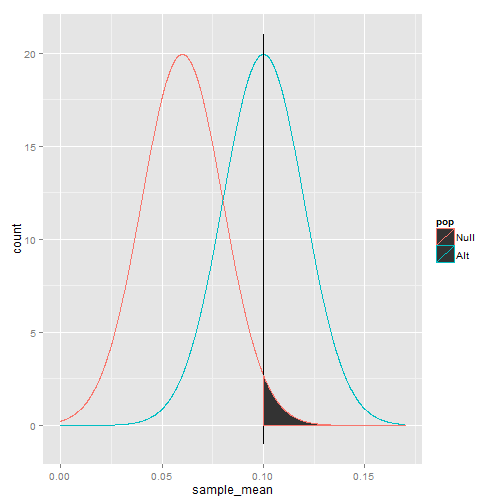

My First Shiny App
Demonstrating a Type I Error
========================================================
author: NJ Blume
date: March 20, 2015

What does the app do?
===
My application, TypeI_Error, helps students learn about Type I errors in statistics by allowing them to manipulate a graph.

You can find my application here:
https://njblume.shinyapps.io/TypeI_Error/

A screenshot on the next page will show you what the user sees. Pay attention to:
- The two input fields on the left (input box and slider)
- The vertical line and the blackened area on the graph
- The text beneath "Your Inference"


User input, responsive graph & text
===


Data Prep: polygons and verticals
========================================================

The data frame df contains the (x,y) coordinates of points that outline 2 distinct sampling distributions (red and blue). Assume that the criterion is set to 0.1 and the observed sample mean to 0.11. I subset the data frame to capture values from the Null distribution that are above the decision boundary. I add endpoints so that the subset defines a polygon. 


```r
TypeI <- subset(df, sample_mean > crit & sample_mean < 12.5 & pop == "Null")
TypeI <- rbind(TypeI[1, ], TypeI, TypeI[1, ])
TypeI[1, "sample_mean"] = crit;
TypeI[1, "count"] = 0;
TypeI[nrow(TypeI), "sample_mean"] = 0.125;
TypeI[nrow(TypeI), "count"] = 0;
```

Pay-Off: a dynamic graph
========================================================


```r
p <- qplot(x=sample_mean, y=count, data=df, geom="line", col=pop) 
p <- p+geom_segment(aes(x=crit,y=-1,xend=crit,yend=21), col='black')
p <- p+geom_polygon(data = TypeI, aes(TypeI$sample_mean, TypeI$count))         
```

***

 
